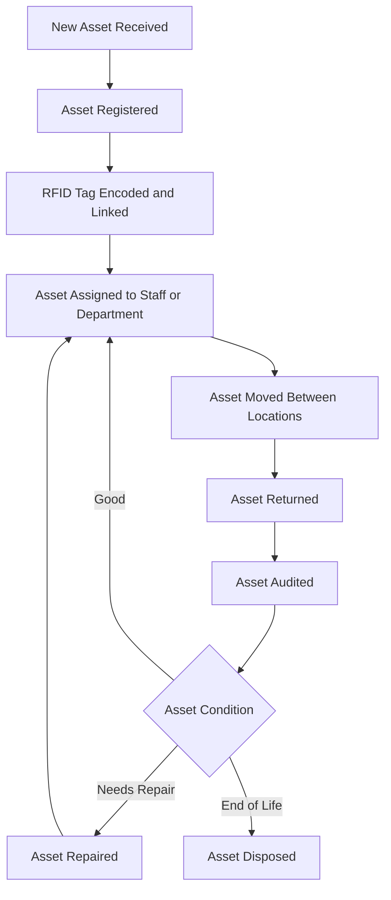
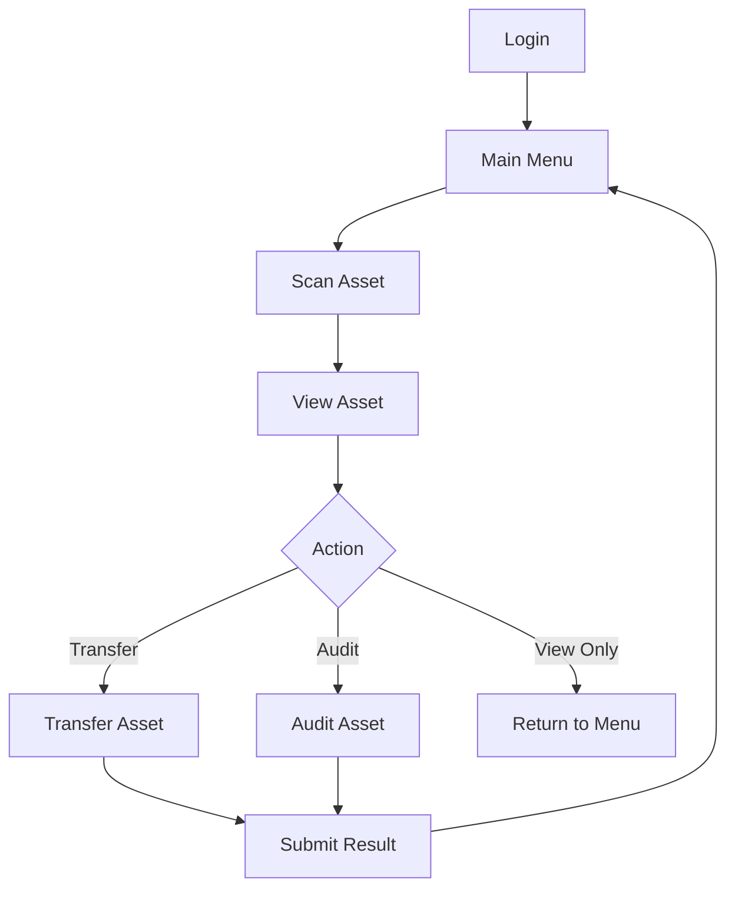
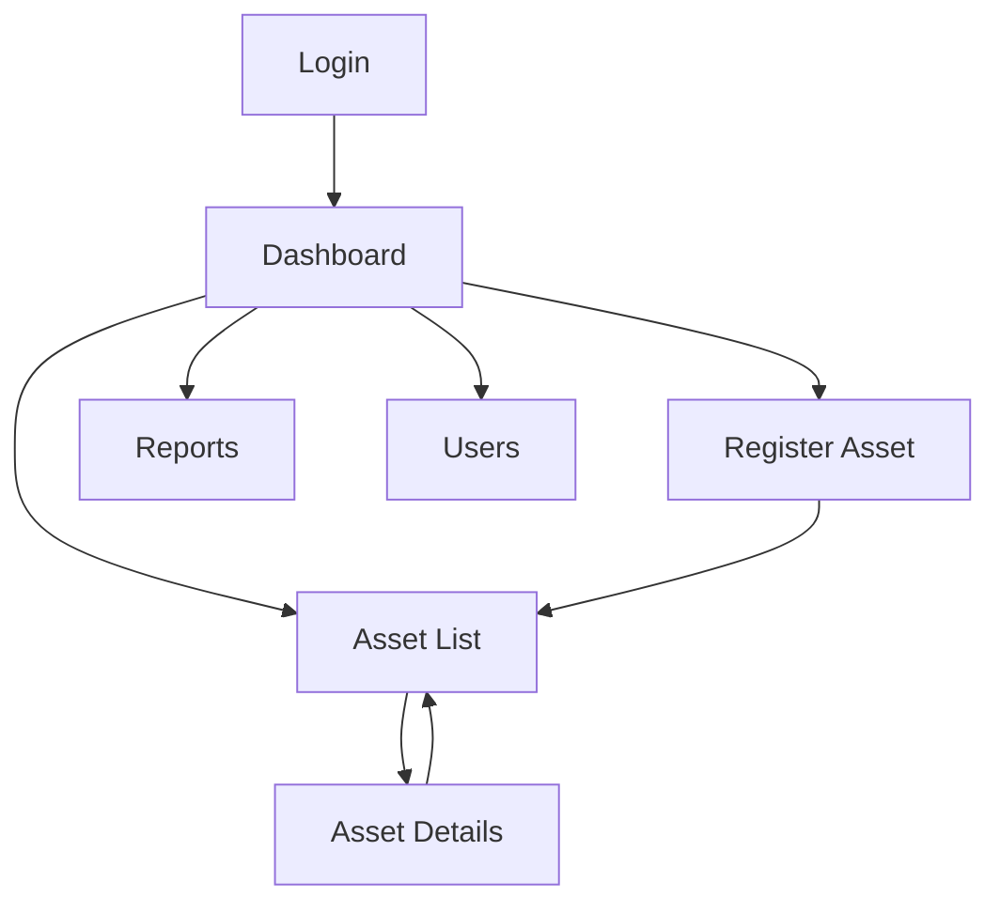

# Business Flow

## Overview

The business flow describes how an asset moves through the Evolve Inventory Management system from initial receiving until final disposal. The system is intended to support complete lifecycle tracking, including registration, RFID tagging, assignment, movement, return, audit, repair, and disposal.

## Asset Lifecycle Flow

## Process 1: New Asset Received

When a new asset is received by the company, inventory or authorized staff will prepare it for registration.

### Key Activities

- Confirm asset received.
- Check asset physical condition.
- Prepare asset details for registration.
- Confirm whether the asset requires RFID tagging.

### Expected Result

The asset is ready to be registered in the system.

## Process 2: Asset Registered

The asset is created in the system with required master data and identification details.

### Key Activities

- Create asset record.
- Enter item name, category, brand, model, and serial number.
- Enter purchase date and warranty expiry, if available.
- Select department, location, custodian, status, and condition.
- Add remarks when needed.

### Expected Result

The asset receives a unique asset code and becomes searchable in the system.

## Process 3: RFID Tag Encoded and Linked

The RFID tag is encoded and linked to the registered asset.

### Key Activities

- Select asset record.
- Scan or enter RFID EPC.
- Encode RFID tag if required by the device workflow.
- Link RFID EPC to the asset.
- Validate that the RFID EPC is not already linked to another active asset.

### Expected Result

The asset can be identified by scanning its RFID tag.

## Process 4: Asset Assigned to Staff or Department

The asset is assigned to a staff member, custodian, department, or operational owner.

### Key Activities

- Select asset.
- Select department.
- Select custodian or assigned user, if applicable.
- Confirm assignment date.
- Update asset status.

### Expected Result

The system records who or which department is responsible for the asset.

## Process 5: Asset Moved Between Locations

Assets may be transferred from one physical location to another.

### Key Activities

- Scan or search asset.
- Select source location.
- Select destination location.
- Enter movement reason.
- Submit transfer.
- Save movement history.

### Expected Result

The asset current location is updated, and the movement transaction is stored for tracking and reporting.

## Process 6: Asset Returned

An assigned asset can be returned to store, inventory, IT, or another responsible department.

### Key Activities

- Scan or search asset.
- Confirm current custodian or department.
- Select return destination.
- Update asset status.
- Record return remarks, if needed.

### Expected Result

The asset is marked as returned and becomes available for reassignment, repair, audit, or disposal depending on condition.

## Process 7: Asset Audited

Audit or stock take activities are performed to verify the existence, location, and condition of assets.

### Key Activities

- Create audit or stock take session.
- Scan assets using handheld device.
- Match scanned assets against expected asset list.
- Mark assets as found, missing, wrong location, or unexpected.
- Record asset condition.
- Submit audit result.

### Expected Result

The system produces audit results and identifies mismatches for follow-up.

## Process 8: Asset Repaired

Assets with issues can be sent for repair and later returned to active use.

### Key Activities

- Update asset status to repair.
- Record repair details and remarks.
- Update asset condition after repair.
- Return asset to available, assigned, or active status after repair completion.

### Expected Result

The system keeps a record of repaired assets and their updated condition.

## Process 9: Asset Disposed

Assets that are no longer usable or required can be disposed.

### Key Activities

- Select asset for disposal.
- Confirm disposal reason.
- Update asset status to disposed.
- Prevent disposed asset from normal assignment or movement.
- Keep disposal record for audit and reporting.

### Expected Result

The asset is removed from active operational use but remains available in historical records.

## Handheld Operation Flow

## Web Operation Flow

## Business Rules

- An asset must be registered before RFID tag assignment.
- One RFID EPC should not be assigned to multiple active assets.
- Asset movement must update the asset current location.
- All transfers, returns, repairs, audits, and disposals should be recorded as history.
- Disposed assets should remain in the database for reporting and audit traceability.
- User access must follow the role matrix.
