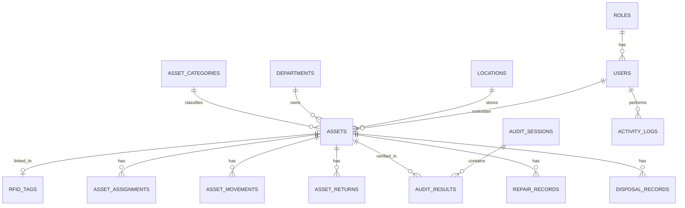

# Data Design

## Overview

This document defines the main data fields, master data, and proposed database entities for the Evolve Inventory Management system. The final database schema may be refined during development, but this document provides the baseline data model.

## Asset Master Data Fields

| Field | Description | Example | Required |
| --- | --- | --- | --- |
| Asset Code | Unique company asset identifier | AST-000001 | Yes |
| Item Name | Name or description of the asset | Dell Laptop | Yes |
| Category | Asset category | Laptop, Monitor, Printer | Yes |
| Brand | Manufacturer or brand | Dell | No |
| Model | Asset model | Latitude 5440 | No |
| Serial Number | Manufacturer serial number | SN123456789 | No |
| RFID EPC | RFID electronic product code | 300833B2DDD9014000000001 | No |
| Barcode/QR | Barcode or QR code value | QR-AST-000001 | No |
| Purchase Date | Date asset was purchased | 2026-04-15 | No |
| Warranty Expiry | Warranty end date | 2029-04-15 | No |
| Department | Responsible department | IT | No |
| Location | Current physical location | HQ Store Room | Yes |
| Custodian/User | Person responsible for the asset | Staff Name | No |
| Status | Current asset status | Available, Assigned, Repair | Yes |
| Condition | Physical condition | Good, Damaged | Yes |
| Remarks | Additional notes | Assigned to new joiner | No |

## Master Data

The system should maintain reusable master data to ensure consistent asset records.

### Asset Categories

Examples:

- Laptop
- Desktop
- Monitor
- Printer
- Network Device
- Peripheral
- Furniture
- Tool
- Other

### Departments

Examples:

- IT
- Finance
- Human Resource
- Operations
- Warehouse
- Sales
- Management

### Locations

Examples:

- Main Store
- IT Room
- Office Area
- Warehouse
- Branch Office
- Repair Area
- Disposal Area

### Asset Status

Recommended status values:

- New
- Available
- Assigned
- Checked Out
- Returned
- In Transfer
- Under Audit
- Repair
- Missing
- Disposed

### Asset Condition

Recommended condition values:

- Good
- Fair
- Damaged
- Needs Repair
- Not Working
- Disposed

## Proposed Entity List

The database should include the following main entities:

- Users
- Roles
- Assets
- Asset Categories
- Departments
- Locations
- RFID Tags
- Asset Assignments
- Asset Movements
- Asset Returns
- Audit Sessions
- Audit Results
- Disposal Records
- Repair Records
- Reports or Export Logs
- Activity Logs

## Entity Relationship Overview

## Proposed Tables

### users

Stores system user accounts.

| Column | Description |
| --- | --- |
| id | Unique user ID |
| username | Login username |
| full_name | User full name |
| email | User email address |
| password_hash | Secure password hash |
| role_id | Role assigned to user |
| department_id | User department |
| is_active | Account active status |
| created_at | Record creation timestamp |
| updated_at | Record update timestamp |

### roles

Stores access roles.

| Column | Description |
| --- | --- |
| id | Unique role ID |
| name | Role name, such as Admin or Auditor |
| description | Role description |
| created_at | Record creation timestamp |
| updated_at | Record update timestamp |

### assets

Stores core asset records.

| Column | Description |
| --- | --- |
| id | Unique asset ID |
| asset_code | Unique company asset code |
| item_name | Asset item name |
| category_id | Asset category |
| brand | Asset brand |
| model | Asset model |
| serial_number | Serial number |
| barcode_qr | Barcode or QR code value |
| purchase_date | Purchase date |
| warranty_expiry | Warranty expiry date |
| department_id | Current department |
| location_id | Current location |
| custodian_user_id | Current custodian user |
| status | Current asset status |
| condition | Current asset condition |
| remarks | Additional remarks |
| created_at | Record creation timestamp |
| updated_at | Record update timestamp |

### rfid_tags

Stores RFID EPC values and assignment status.

| Column | Description |
| --- | --- |
| id | Unique RFID tag ID |
| epc | Unique RFID EPC |
| asset_id | Linked asset ID |
| status | Active, replaced, unlinked, or retired |
| encoded_at | Tag encoded timestamp |
| linked_at | Tag linked timestamp |
| unlinked_at | Tag unlinked timestamp |
| created_at | Record creation timestamp |
| updated_at | Record update timestamp |

### asset_assignments

Stores asset assignment and check-out history.

| Column | Description |
| --- | --- |
| id | Unique assignment ID |
| asset_id | Related asset |
| assigned_to_user_id | Assigned user or custodian |
| department_id | Assigned department |
| assigned_by_user_id | User who performed assignment |
| assigned_at | Assignment timestamp |
| returned_at | Return timestamp |
| status | Active or completed |
| remarks | Assignment remarks |

### asset_movements

Stores asset transfer and movement history.

| Column | Description |
| --- | --- |
| id | Unique movement ID |
| asset_id | Related asset |
| from_location_id | Source location |
| to_location_id | Destination location |
| moved_by_user_id | User who performed movement |
| moved_at | Movement timestamp |
| reason | Movement reason |
| remarks | Movement remarks |

### audit_sessions

Stores audit or stock take sessions.

| Column | Description |
| --- | --- |
| id | Unique audit session ID |
| name | Audit session name |
| scope_type | Location, department, category, or full audit |
| scope_id | Related scope record ID, when applicable |
| started_by_user_id | User who started audit |
| started_at | Audit start timestamp |
| completed_at | Audit completion timestamp |
| status | Draft, active, completed, or cancelled |
| remarks | Audit remarks |

### audit_results

Stores scanned asset results for each audit session.

| Column | Description |
| --- | --- |
| id | Unique audit result ID |
| audit_session_id | Related audit session |
| asset_id | Related asset |
| scanned_rfid_epc | RFID EPC scanned |
| expected_location_id | Expected location |
| actual_location_id | Actual scanned location |
| result_status | Found, missing, wrong location, unexpected, or damaged |
| condition | Asset condition during audit |
| scanned_by_user_id | User who scanned asset |
| scanned_at | Scan timestamp |
| remarks | Audit result remarks |

### repair_records

Stores repair history.

| Column | Description |
| --- | --- |
| id | Unique repair record ID |
| asset_id | Related asset |
| reported_by_user_id | User who reported issue |
| repair_status | Open, in progress, completed, or cancelled |
| issue_description | Description of issue |
| repair_notes | Repair notes |
| sent_at | Date sent for repair |
| returned_at | Date returned from repair |
| created_at | Record creation timestamp |
| updated_at | Record update timestamp |

### disposal_records

Stores asset disposal records.

| Column | Description |
| --- | --- |
| id | Unique disposal record ID |
| asset_id | Related asset |
| disposed_by_user_id | User who disposed asset |
| disposed_at | Disposal timestamp |
| reason | Disposal reason |
| remarks | Disposal remarks |

### activity_logs

Stores important user activity for audit trail.

| Column | Description |
| --- | --- |
| id | Unique log ID |
| user_id | User who performed action |
| action | Action name |
| entity_type | Entity affected |
| entity_id | Entity record ID |
| details | Summary of action |
| created_at | Log timestamp |

## Key Data Rules

- Asset code must be unique.
- RFID EPC must be unique.
- Active RFID EPC must not be linked to more than one active asset.
- Serial number should be unique where applicable.
- Asset movement must create a movement history record.
- Asset assignment must create an assignment history record.
- Audit scans must be linked to an audit session.
- Disposal does not delete the asset record.
- Important user actions should be recorded in activity logs.

## Indexing Recommendations

To support fast search and reporting, indexes should be considered for:

- assets.asset_code
- assets.serial_number
- assets.status
- assets.department_id
- assets.location_id
- rfid_tags.epc
- asset_movements.asset_id
- audit_results.audit_session_id
- audit_results.asset_id
- activity_logs.user_id
- activity_logs.created_at
