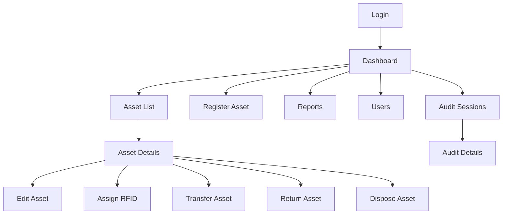
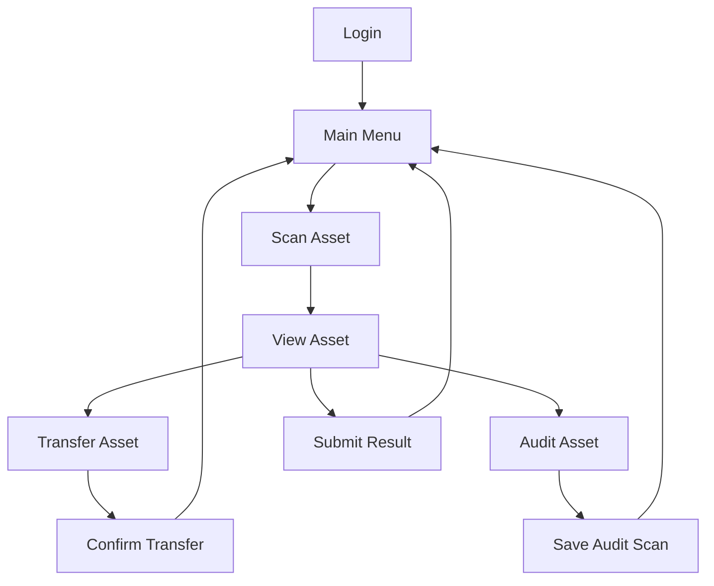

# System Design

## Overview

This document describes the main system modules, navigation flows, roles, and interaction design for Evolve Inventory Management. The goal is to provide a clear development blueprint before implementation starts.

## System Modules

### Dashboard

The dashboard provides a management overview of inventory status.

Main features:

- Asset count summary.
- Status summary.
- Department summary.
- Location summary.
- Recent movements.
- Audit summary.
- Missing, repair, and disposal indicators.

### Asset Registration

The asset registration module allows authorized users to create and maintain asset records.

Main features:

- Create asset.
- Update asset information.
- Assign category, department, location, and custodian.
- Capture serial number, barcode, QR code, and RFID EPC.
- Store purchase date and warranty expiry.
- Maintain status, condition, and remarks.

### RFID Tag Management

The RFID tag management module handles RFID EPC assignment to assets.

Main features:

- Scan RFID tag.
- Encode RFID tag.
- Link RFID EPC to asset.
- Replace RFID tag.
- Unlink RFID tag.
- Validate duplicate EPC.

### Asset Search

The asset search module allows users to find assets quickly.

Main features:

- Search by asset code.
- Search by RFID EPC.
- Search by serial number.
- Search by barcode or QR code.
- Filter by category, department, location, status, and custodian.

### Assignment

The assignment module manages asset ownership and responsibility.

Main features:

- Assign asset to user.
- Assign asset to department.
- Check out asset.
- View assignment history.
- Update custodian.

### Transfer and Movement

The transfer module manages location changes.

Main features:

- Transfer asset between locations.
- Record source and destination location.
- Record movement reason.
- Update current asset location.
- View movement history.

### Return

The return module records assets returned from a user, department, or location.

Main features:

- Check in returned asset.
- Update status.
- Update condition.
- Record return remarks.
- Make asset available for reassignment, repair, audit, or disposal.

### Audit and Stock Take

The audit module supports physical verification of assets.

Main features:

- Create audit session.
- Define audit scope.
- Scan assets using handheld device.
- Compare expected and scanned assets.
- Mark found, missing, wrong location, unexpected, or damaged.
- Submit audit result.
- Generate audit report.

### Disposal

The disposal module records assets removed from active use.

Main features:

- Mark asset as disposed.
- Record disposal reason.
- Record disposal date and user.
- Prevent future active movement or assignment.
- Keep disposal history.

### User Management

The user management module handles credentials and access control.

Main features:

- Create users.
- Edit users.
- Assign roles.
- Activate or deactivate users.
- Manage access permissions.

### Report

The report module provides management and audit reports.

Main features:

- Asset listing.
- Assets by category.
- Assets by department.
- Assets by location.
- Assets by custodian.
- Movement history.
- Audit result.
- Missing asset.
- Disposal report.
- Warranty expiry report.
- Export to Excel, CSV, or PDF.

## Web Navigation Flow

## Handheld Navigation Flow

## Web Screens

### Login Screen

Purpose:

- Authenticate users before accessing the system.

Fields and actions:

- Username or email.
- Password.
- Login button.
- Error message for invalid credentials.

### Dashboard Screen

Purpose:

- Provide a quick overview of inventory and asset status.

Sections:

- Total assets.
- Assets by status.
- Assets by category.
- Assets by location.
- Recent movement list.
- Audit summary.

### Asset List Screen

Purpose:

- View and search asset records.

Features:

- Search field.
- Filters.
- Asset table.
- View details action.
- Register asset action.
- Export list action, if permitted.

### Asset Details Screen

Purpose:

- Show full asset information and history.

Sections:

- Asset identity.
- RFID and barcode information.
- Assignment information.
- Location information.
- Status and condition.
- Movement history.
- Audit history.
- Repair and disposal history.

### Register Asset Screen

Purpose:

- Create a new asset record.

Sections:

- Basic asset information.
- Identification information.
- Purchase and warranty information.
- Department and location information.
- Status, condition, and remarks.

### Reports Screen

Purpose:

- Generate and export reports.

Features:

- Report type selection.
- Filter by date, department, location, category, or status.
- Preview report.
- Export report.

### Users Screen

Purpose:

- Manage users and roles.

Features:

- User list.
- Create user.
- Edit user.
- Assign role.
- Activate or deactivate account.

## Handheld Screens

### Handheld Login Screen

Purpose:

- Authenticate handheld users.

Fields and actions:

- Username or email.
- Password.
- Login button.

### Main Menu

Purpose:

- Allow quick access to common scanning tasks.

Menu items:

- Scan Asset.
- Transfer Asset.
- Audit Asset.
- Submit Result.

### Scan Asset Screen

Purpose:

- Scan RFID tag and identify an asset.

Features:

- Start scan.
- Display scanned RFID EPC.
- Show matching asset.
- Show unregistered tag message if no asset is found.

### View Asset Screen

Purpose:

- Display scanned asset details.

Sections:

- Asset code.
- Item name.
- RFID EPC.
- Serial number.
- Location.
- Department.
- Custodian.
- Status.
- Condition.

### Transfer Asset Screen

Purpose:

- Move scanned asset to another location.

Fields and actions:

- Current location.
- Destination location.
- Movement reason.
- Submit transfer.

### Audit Asset Screen

Purpose:

- Add scanned asset to an audit session.

Fields and actions:

- Audit session.
- Scanned asset details.
- Actual location.
- Condition.
- Result status.
- Submit audit scan.

## Role-Based Access Design

| Module | Admin | Store/Inventory | IT Staff | Auditor | Department User |
| --- | --- | --- | --- | --- | --- |
| Dashboard | Yes | Yes | Yes | Yes | Limited |
| Asset Registration | Yes | Yes | Yes | No | No |
| Update Asset | Yes | Yes | Yes | No | No |
| RFID Tag Management | Yes | Yes | Yes | No | No |
| Asset Search | Yes | Yes | Yes | Yes | Limited |
| Assignment | Yes | Yes | Yes | No | No |
| Transfer/Movement | Yes | Yes | Yes | No | No |
| Return | Yes | Yes | Yes | No | No |
| Audit/Stock Take | Yes | View | View | Yes | No |
| Disposal | Yes | Limited | Limited | No | No |
| User Management | Yes | No | No | No | No |
| Report | Yes | Yes | Yes | Yes | Limited |

## API Design Overview

The backend API should expose endpoints for:

- Authentication and user session management.
- User and role management.
- Asset create, update, view, and search.
- RFID tag link, unlink, encode, and validation.
- Assignment and check-in/check-out.
- Transfer and movement.
- Return.
- Audit session and scan results.
- Repair and disposal.
- Report generation and export.

## Security Design

- All protected screens must require login.
- API endpoints must validate authentication token.
- Role-based access control must be enforced on the backend.
- Passwords must be stored as secure hashes.
- Important actions should be logged.
- User sessions should expire according to security policy.
- Data exports should only be available to authorized users.

## Error Handling Design

The system should handle:

- Invalid login.
- Missing required fields.
- Duplicate asset code.
- Duplicate RFID EPC.
- Unknown scanned RFID tag.
- Invalid movement destination.
- Unauthorized action.
- Failed network connection from handheld device.
- Failed report generation.

## Audit Trail Design

The system should record important actions, including:

- User login.
- Asset creation.
- Asset update.
- RFID tag assignment or replacement.
- Asset assignment.
- Asset transfer.
- Asset return.
- Audit result submission.
- Repair update.
- Disposal.
- User account changes.
