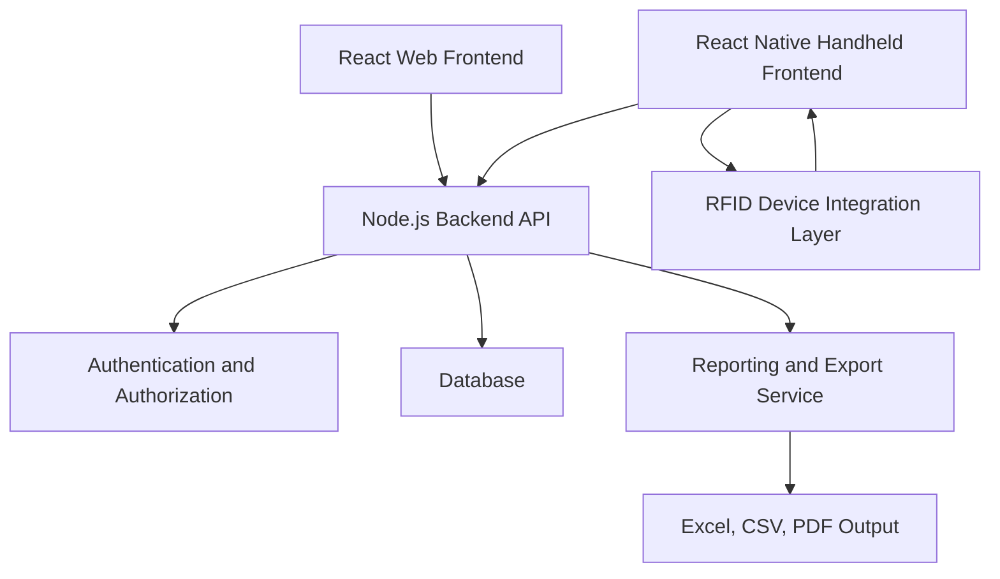
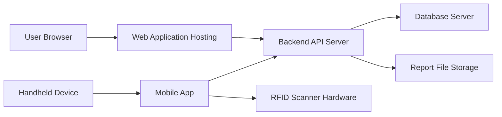
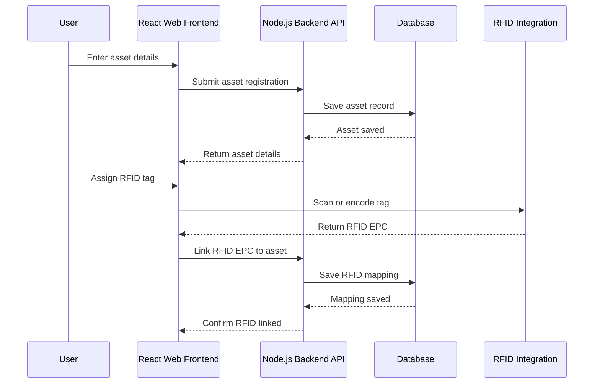
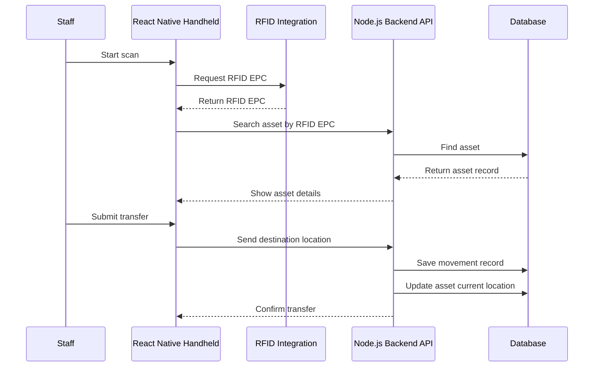
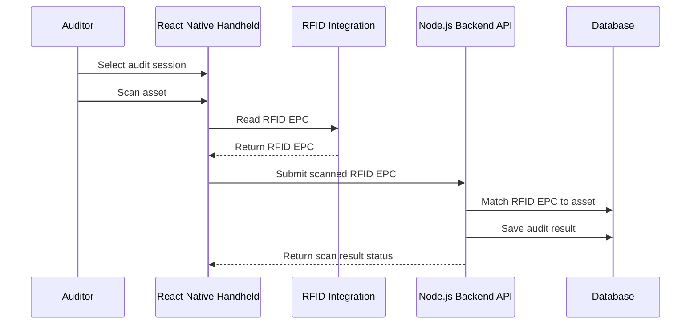

# System Architecture

## Overview

The Evolve Inventory Management system will be built using a web frontend, handheld frontend, backend API, database, RFID device integration layer, authentication, and reporting/export services.

## Architecture Components

- React web frontend
- React Native handheld frontend
- Node.js backend API
- Database
- RFID device integration layer
- Authentication
- Reporting/export

## High-Level Architecture

## Component Responsibilities

### React Web Frontend

The web frontend is used by Admin, Store/Inventory Staff, IT Staff, Auditor, and Department Users.

Responsibilities:

- Login screen.
- Dashboard.
- Asset list.
- Asset details.
- Asset registration.
- RFID tag management screens.
- Assignment and movement screens.
- Audit management screens.
- Disposal screens.
- User management.
- Reports and exports.

### React Native Handheld Frontend

The handheld frontend is used for scanning and field operations.

Responsibilities:

- Login screen.
- Main menu.
- Scan asset.
- View scanned asset.
- Transfer asset.
- Audit asset.
- Submit scan results.
- Communicate with RFID scanner hardware through the integration layer.
- Send scan and transaction data to backend API.

### Node.js Backend API

The backend API contains the main business logic.

Responsibilities:

- Authenticate users.
- Enforce role-based access control.
- Create and update asset records.
- Link RFID tags to assets.
- Process handheld scan results.
- Manage asset assignments.
- Manage transfers and movements.
- Manage returns.
- Manage audit sessions and results.
- Manage repair and disposal records.
- Generate reports.
- Write activity logs.
- Validate all data before saving to database.

### Database

The database stores master data, transactions, and audit records.

Responsibilities:

- Store users and roles.
- Store asset master records.
- Store RFID EPC mapping.
- Store department and location master data.
- Store assignment history.
- Store movement history.
- Store audit sessions and audit results.
- Store repair and disposal records.
- Store activity logs.

### RFID Device Integration Layer

The RFID integration layer connects the handheld application to RFID scanning and encoding functions.

Responsibilities:

- Read RFID EPC from handheld scanner.
- Encode RFID tag where supported.
- Return scanned RFID data to handheld app.
- Handle scanner connection errors.
- Provide a consistent interface for the handheld app.

### Authentication and Authorization

Authentication confirms user identity. Authorization controls what each user can access.

Responsibilities:

- Validate login credentials.
- Issue secure session or access token.
- Verify token on API requests.
- Apply role-based permissions.
- Block unauthorized access.

### Reporting and Export

The reporting/export function prepares operational and management reports.

Responsibilities:

- Generate asset list reports.
- Generate movement reports.
- Generate audit reports.
- Generate disposal reports.
- Generate warranty expiry reports.
- Export reports to Excel, CSV, or PDF.

## Deployment View

## Data Flow: Register Asset and Link RFID

## Data Flow: Handheld Scan and Transfer

## Data Flow: Audit or Stock Take

## Suggested Technology Stack

| Layer | Recommended Technology |
| --- | --- |
| Web Frontend | React |
| Handheld Frontend | React Native |
| Backend API | Node.js |
| Database | MySQL |
| Authentication | JWT or secure server-side sessions |
| RFID Integration | Native mobile module, vendor SDK, or device API |
| Reporting | Server-side report generation with Excel, CSV, and PDF export |

## Integration Points

The system will require integration between:

- Web frontend and backend API.
- Handheld frontend and backend API.
- Handheld frontend and RFID scanner hardware.
- Backend API and database.
- Backend API and report generation/export.
- Backend API and authentication service.

## Security Architecture

- All users must authenticate before accessing protected functions.
- Backend API must verify authentication token for each protected request.
- Backend API must enforce role permissions.
- Sensitive credentials must not be stored in plain text.
- All important transactions must be logged.
- Report exports should only be available to authorized users.
- Production deployment should use HTTPS.

## Offline and Connectivity Considerations

Handheld devices may face unstable network conditions during scanning activities. The first version may require online connectivity, but the system design should allow future offline support.

Possible future offline behavior:

- Store scan results locally when offline.
- Sync pending scan results when network is restored.
- Prevent conflicting updates during sync.
- Show clear sync status to handheld users.

## Scalability Considerations

- Asset search should use indexed fields.
- RFID EPC lookup should be optimized.
- Audit sessions should support large scan volumes.
- Reports should be generated efficiently for large datasets.
- Background jobs may be used for heavy report generation.

## Backup and Recovery Considerations

- Database backups should be scheduled regularly.
- Report files should be stored in a controlled location.
- Audit and movement history should not be deleted during normal operations.
- Recovery procedure should be defined before production release.

## Architecture Assumptions

- The backend API will be the single source of business rules.
- The database will be the system of record.
- The handheld app will communicate with RFID hardware through a device-specific integration layer.
- The RFID scanner hardware or vendor SDK will provide EPC reading capability.
- Export formats will be confirmed during implementation.
